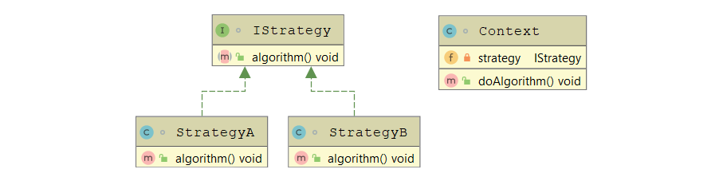

# Strategy Design Pattern

> Define a family of algorithms, encapsulate each one, and make them interchangeable. Strategy lets the algorithm vary independently from clients that use it.

## Motivation

- You want to maintain **volatile** code away from the **main** code for your app.
- You want to change the algorithm you use at **runtime**.

## UML



## Members

1. **`IStrategy`** – a common **interface** for all algorithms.
1. **Concrete Strategies (`StrategyA`, `StrategyB`, etc.)** – implements the algorithm using the `IStrategy` interface.
1. **`Context`** – contains an `IStrategy` variable reference to call the implemented algorithm.

## Implementation Example

```java
public interface TextFormatter {
    String format(String text);
}
```

```java
public class CapTextFormatter implements TextFormatter {
    @Override
    public String format(String text) {
        return text.toUpperCase();
    }
}

public class LowerTextFormatter implements TextFormatter {
    @Override
    public String format(String text) {
        return text.toLowerCase();
    }
}
```

```java
public class TextEditor {

    private TextFormatter textFormatter;

    public setFormatterAlgorithm(TextFormatter textFormatter) {
        this.textFormatter = textFormatter;
    }

    public void publishText(String text) {
        System.out.println(textFormatter.format(text));
    }

}
```

## Testing Example

```java
public class TestStrategyPattern {

    public static void main(String[] args) {
        TextEditor editor = new TextEditor();
        editor.setFormatterAlgorithm(new CapTextFormatter());
        editor.publishText("Testing text in caps formatter");
        editor.setFormatterAlgorithm(new LowerTextFormatter());
        editor.publishText("Testing text in lower formatter");
    }

}
```

```console
TESTING TEXT IN CAPS FORMATTER
testing text in lower formatter
```
