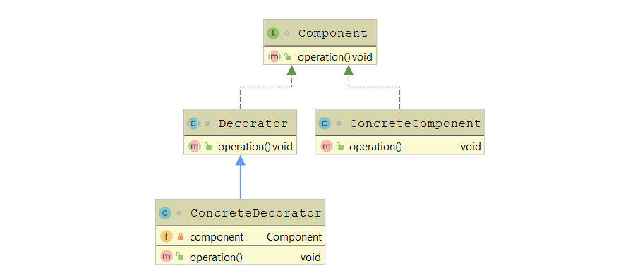

# Decorator Design Pattern

> Attach additional responsibilities to an object dynamically. Decorators provide a flexible alternative to subclassing for extending functionality.

## Motivation

- Add responsibilities to **individual** objects dynamically without affecting other objects.
- Add responsibilities that can be withdrawn.
- Use an extending alternative for inheritance.

## UML



## Members

1. **`Component`** – defines the interface for objects that can have responsibilities added to them dynamically.
1. **`ConcreteComponent`** – defines an object to which additional responsibilities can be attached.
1. **`Decorator`** – maintains a reference to a `Component` and defines an interface that conforms to `Component`'s interface.
1. **`ConcreteDecorator`** – adds responsibilities to `Component`.

## Implementation Example

```java
public interface Component {
    String description();
}
```

```java
public class Computer implements Component
{
    public String description() {
        return "computer";
    }
}
```

```java
public abstract class ComputerDecorator implements Component {
    public abstract String description();
}
```

```java
public class Disk extends ComputerDecorator
{
    Computer computer;

    public Disk(Computer c) {
        computer = c;
    }

    public String description() {
        return computer.description() + " and a disk";
    }

}
```

```java
public class CD extends ComputerDecorator
{
    Computer computer;

    public CD(Computer c) {
        computer = c;
    }

    public String description() {
        return computer.description() + " and a CD";
    }

}
```

## Testing Example

```java
public class TestDecoratorPattern
{

    public static void main(String args[])
    {
        Computer computer = new Computer();
        computer = new Disk(computer);
        computer = new CD(computer);
        computer = new CD(computer);
        System.out.println("You're getting a" + computer.description());
    }

}
```

```console
You’re getting a computer and a disk and a CD and a CD
```
